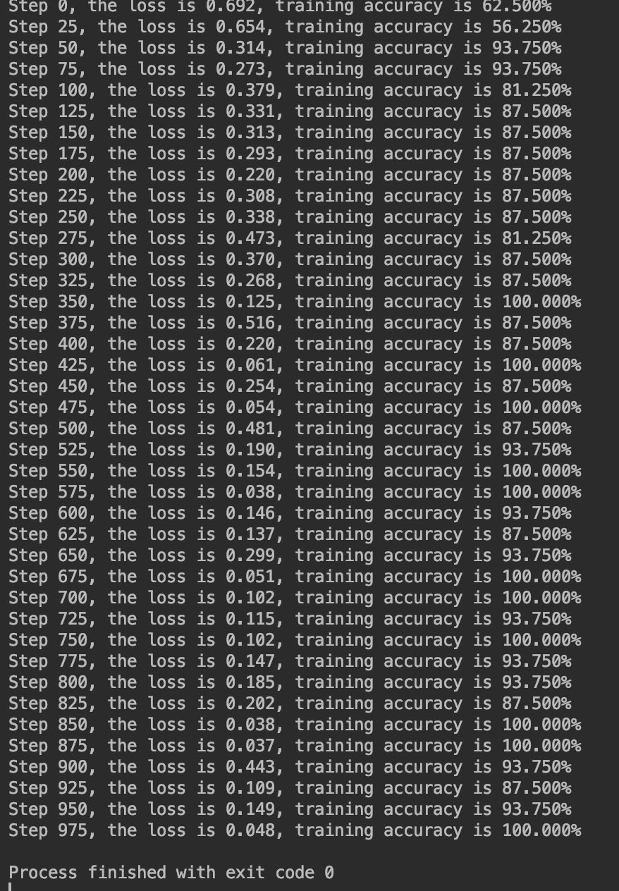
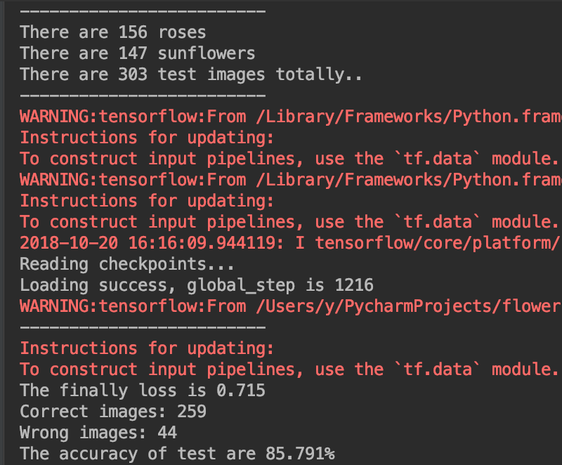

# MINI-project2
The project is based on tensorflow, using a simple CNN. Through the model, we can train and get the logs file of the model, 
and classify the roses and the sunflowers. With a 1218 images of training set and a 0.00005 learning rate, the loss can be reduce to about 0.1, and the accuracy when we test a new image from testing set can be about 85%.

After training the model, I used AutoML Vision as a benchmark, and the result is doubtless wonderful, the accuracy can be 100% when using the same training set(however 4 images cannot be submitted so there is 1214 images).But when it comes to the test set, something is wrong and I cannot test the model with new images..

